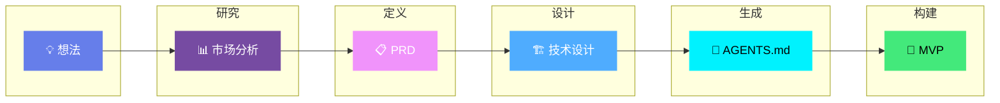

<p align="center">
  
</p>

<h3 align="center">一个实用的AI工作流程，用于快速交付MVP</h3>

<p align="center">
  <strong>通过结构化提示词、Agent文档和AI辅助编码工作流程，将想法转化为MVP。</strong>
</p>

<p align="center">
  <strong>⭐ 已针对 Trae Solo CN 优化 — 开箱即用！</strong>
</p>

<p align="center">
  已用于以下项目：<a href="https://vibeworkflow.app">vibeworkflow.app</a>、<a href="https://moneyvisualiser.com">moneyvisualiser.com</a>、<a href="https://caglacabaoglu.com">caglacabaoglu.com</a> 和 <a href="https://alpyalay.org/realdex">RealDex App</a>。
</p>

<p align="center">
  <a href="LICENSE"></a>
  <a href="http://makeapullrequest.com"></a>
  <a href="https://github.com/KhazP/vibe-coding-prompt-template/stargazers"></a>
  <a href="https://github.com/KhazP/vibe-coding-prompt-template/issues"></a>
</p>

<p align="center">
  
  
  
  
  
</p>

---

## 目录
- [使用此工作流构建的项目](#使用此工作流构建的项目)
- [工作流概述](#工作流概述)
- [快速开始和5个步骤](#快速开始和5个步骤)
- [前提条件和工具](#前提条件和工具)
- [高级Agent实践](#高级agent实践)
- [项目结构和部署](#项目结构和部署)
- [常见陷阱和故障排除](#常见陷阱和故障排除)
- [进一步阅读](#进一步阅读)
- [Trae Solo CN 快速开始](#trae-solo-cn-快速开始)

---

## 使用此工作流构建的项目

本文档记录了多个已交付项目的工作流。目标很简单：提前做好思考工作，向工具提供清晰的上下文，保持构建阶段顺利进行。

| 项目 | 简介 |
| :-- | :-- |
| [vibeworkflow.app](https://vibeworkflow.app) | 一个围绕相同结构化vibe-coding工作流构建的交互式Web应用。 |
| [moneyvisualiser.com](https://moneyvisualiser.com) | 一个在3D环境中可视化资金的金钱可视化网站。 |
| [caglacabaoglu.com](https://caglacabaoglu.com) | 使用相同的PRD到Agent执行方法构建的生产作品集和展示网站。 |
| [alpyalay.org/realdex](https://alpyalay.org/realdex) | 一个基于React Native的移动应用，让你捕捉动物，并将它们放入类似宝可梦的收藏中。 |

<p align="center">
  <sub>由 <a href="https://x.com/alpyalay">Alp Yalay</a> 维护。</sub>
</p>

---

## 工作流概述

该流程分为五个阶段，从想法验证到可工作的代码：



<p align="center">
  <a href=".claude/README.md">
    
  </a>
  <a href="https://vibeworkflow.app/#/vibe-coding">
    
  </a>
</p>

---

## 快速开始和5个步骤

> TL;DR：运行研究，将其转化为PRD，选择技术栈，生成Agent文件，然后在小型迭代中构建。

### 第一阶段：产品构思
在前三个步骤中，使用ChatGPT、Claude.ai、Gemini或任何其他聊天工具。你还不需要仓库。

###  深度研究
<details open>
<summary><b>评估这个想法是否值得构建</b> - 20-30分钟</summary>

这一步为你提供关于需求、竞争对手以及范围是否现实的快速评估。

1. 打开 [`part1-deepresearch.md`](part1-deepresearch.md) 并**复制全部内容**。
2. **粘贴**到你偏好的AI平台聊天中（如Claude.ai、ChatGPT或Gemini），然后按**回车**。
3. AI会就你的想法问几个问题。在聊天中如实回答。
4. AI会根据你的回答生成一份全面的研究文档。
5. **保存输出**到本地文件，命名为 `research-[你的应用名称].md`（或`.txt`），或者**保持这个聊天窗口打开**以用于第2步。

提示：如果你的聊天工具支持网络搜索，请打开它，以便统计数据和竞争对手引用保持最新。
</details>

###  产品需求（PRD）
<details open>
<summary><b>写下MVP实际需要做什么</b> - 15-20分钟</summary>

这将把粗略的想法转化为你可以构建的范围。

1. 复制 [`part2-prd-mvp.md`](part2-prd-mvp.md) 的内容。
2. **选项A（同一聊天）：** 如果你保持了聊天窗口打开，将提示粘贴到深度研究输出的下方。
3. **选项B（新聊天）：** 开始一个新聊天，粘贴你保存的 `research-[你的应用名称].md` 内容，然后在下面粘贴第2部分的提示。
4. 按回车，回答AI提出的任何澄清问题，让它生成你的需求。
5. **保存最终输出**为 `PRD-[你的应用名称]-MVP.md`。
</details>

###  技术设计
<details open>
<summary><b>选择一个你真正可以交付的技术栈</b> - 15-20分钟</summary>

这一步帮助你选择技术栈并决定在哪里保持简单。

1. 复制 [`part3-tech-design-mvp.md`](part3-tech-design-mvp.md) 的内容。
2. 粘贴到你的**持续对话中**（或者一个新的对话中，确保附加上第2步的 `PRD-[你的应用名称]-MVP.md` 作为上下文）。
3. AI会就你的预算、时间线和复杂度容忍度提出问题。
4. 讨论它提出的权衡（例如，全代码vs无代码构建器）。
5. 一旦确定技术栈，**保存输出**为 `TechDesign-[你的应用名称]-MVP.md`。
</details>

### 第二阶段：在你的IDE中执行
进入Cursor、带有Copilot的VS Code、Claude Code或你偏好的编码环境。这是项目变成代码的地方。

###  设置Agent文件
<details open>
<summary><b>创建你的编码Agent将依赖的文档和指令</b> - 1-2分钟</summary>

这一步用你的PRD和技术设计填充 `AGENTS.md` 和支持文档。

1. 点击GitHub上的 **"Use this template"**（或者在本地克隆此仓库）。
2. 在你的 **AI IDE**（如Cursor或VS Code）中打开这个克隆的仓库文件夹。
3. 在你的项目根目录创建一个 `docs/` 文件夹（如果尚不存在）。
4. 使用以下名称将你保存的文档移动到 `docs/`：
   - `docs/PRD-[你的应用名称]-MVP.md`
   - `docs/TechDesign-[你的应用名称]-MVP.md`
   - 可选：`docs/research-[你的应用名称].md`（或`.txt`以保持向后兼容）
5. 在你的IDE中打开AI聊天，输入：*"读取 [`part4-notes-for-agent.md`](part4-notes-for-agent.md)，按照其指示操作，然后设置我的工作区。"*
6. Agent应该从 `/templates/` 复制模板到你的项目根目录，并使用 `docs/` 中的文件填充占位符。
</details>

###  使用AI Agent构建
<details open>
<summary><b>以小型、可审查的块构建MVP</b> - 1-3小时</summary>

选择你的开发环境并开始迭代：

1. 确保你新生成的 `AGENTS.md` 和配置文件物理上位于项目文件夹中。
2. 给你的Agent发出**第一个命令：**
   > *"读取 AGENTS.md，提议一个第一阶段计划，等待我的批准，然后逐步构建。"*
3. 把Agent当作初级开发者。让它在每个主要功能后停下来，解释差异，并在可能的情况下运行测试。
4. **重复循环**直到你的MVP完成：

**推荐循环：**
```text
╭──────────────╮      ╭──────────────╮      ╭──────────────╮
│   📝 计划    │ ───>│  ⚡ 执行  │ ───>│  🔍 验证  │
│  （审批）    │      │  （一个功能） │      │   （测试）   │
╰──────────────╯      ╰──────────────╯      ╰──────────────╯
       ▲                                           │
       └───────────────────────────────────────────┘
```
</details>

---

## 前提条件和工具

你需要一个现代浏览器、几个小时，以及在工具之间移动文件和复制粘贴的足够舒适度。你不需要成为经验丰富的开发者。

### 平台选择指南

| 重点领域 | 推荐工具 |
|------------|-------------------|
| **快速原型（全栈）** | （包含Agent/Plan模式、数据库、认证） |
| **生产就绪前端** | （Vercel原生，精确的Next.js/React组件） |
| **学习/沙盒编码** | （动态上下文）或带有Copilot的VS Code |
| **复杂逻辑/多Agent** | （Agent团队）或GitHub Copilot CLI |
| **预算有限** | （免费）+ VS Code |

注意：我不会按原样将此工作流用于原生硬件工作、受监管产品或安全关键系统。

---

## 高级Agent实践

<details open>
<summary><b>1. 产物优先记忆和压缩</b></summary>

为避免上下文过载，让Agent将内容写入文件，而不是试图在一个巨大的聊天中保留所有内容：
- **压缩和交接：** 使用原生压缩（Copilot CLI中的 `/compact`，Claude Code逻辑）而不是硬重置。当你切换会话时，让Agent写一个 `001-spec.md` 或 `recap.md`，然后只将那个文件加载到新聊天中。
- **动态上下文（Cursor）：** 让Agent将发现保存到真实文件中，而不是埋入聊天历史中。
- 如果你必须重启，附加 `AGENTS.md`、`docs/PRD-[你的应用名称]-MVP.md` 和你最新的交接产物。
</details>

<details open>
<summary><b>2. 多Agent编排和插件</b></summary>

- **Agent团队：** 像Claude Code这样的工具支持多个Agent并行工作。将它们当作分配的角色，而不是魔法。
- **编辑前计划：** 在执行Agent开始更改文件之前，先向主Agent请求批准的计划。这减少了静默回归。
- 将 `AGENTS.md` 作为真相的来源，然后添加工具特定的插件或 `.cursor/rules/` 以无缝扩展能力。
</details>

<details>
<summary><b>3. 模型策略矩阵</b></summary>

使用模型家族而不是固定的版本名称。随着模型在你之下交换，这会更好地老化。

| 策略 | 主要家族 | 适用场景 | 速度 |
|----------|------------------|----------|:-----:|
| 速度优先 | Gemini Flash、Claude Sonnet | 快速原型、广泛迭代 | 高 |
| 平衡 | Claude Sonnet、Gemini Pro | 日常编码、调试、规划 | 中高 |
| 深度优先 | Claude Opus、Gemini Pro | 深度推理、复杂重构 | 中 |
</details>

<details>
<summary><b>4. Agent可观察性</b></summary>

当Agent忽略指令或行为不一致时：
1. 检查加载了哪些指令/规则/钩子。
2. 确认工具权限和被阻止的操作。
3. 验证活动会话上下文未被重置。
4. 用明确指令顺序重新运行：*"先读取 AGENTS.md，然后 agent_docs/，然后执行。"*
</details>

---

## 项目结构和部署

### 推荐的项目骨架
```
your-app/
├── 📁 docs/
│   ├── research-YourApp.md
│   ├── PRD-YourApp-MVP.md
│   └── TechDesign-YourApp-MVP.md
├── 📁 agent_docs/
│   ├── tech_stack.md
│   ├── code_patterns.md
│   ├── project_brief.md
│   ├── product_requirements.md
│   └── testing.md
├── 📄 AGENTS.md                  # 通用AI指令（主契约）
├── 📄 MEMORY.md                  # 产物优先记忆，用于会话连续性
├── 📁 specs/                     # Agent交接产物（例如 001-feature-spec.md）
├── 📁 .cursor/rules/             # Cursor规则（首选）
└── 📁 src/                       # 你的应用代码
```

### 部署和安全

一旦MVP工作，在部署之前进行最终检查：
1. **安全检查：** 检查依赖项、密钥、认证路径和速率限制。
2. **推送和部署：**
   -  用于 Next.js、React、前端应用。
   -  用于静态站点、边缘函数。

---

## 常见陷阱和故障排除

<details>
<summary><b>避免这些错误</b></summary>

| 陷阱 | 解决方案 |
|---------|----------|
| 跳过发现工作 | 先运行第1部分的研究提示 |
| 让Agent单独发布代码 | 在合并前审查差异并运行测试 |
| 发布自动生成的UI | 在发布前测试可访问性和安全性 |
| 强制一个工具做所有事情 | 混合工具，IDE + 终端 + 构建器通常效果更好 |

</details>

<details>
<summary><b>Agent故障排除</b></summary>

| 问题 | 解决方案 |
|--------|----------|
| **"AI忽略我的文档"** | 说：*"先读取 AGENTS.md、PRD 和 TechDesign。在编码前总结关键需求。"* |
| **"代码与PRD不匹配"** | 说：*"重新读取PRD中关于[功能]的部分，列出验收标准，然后重构。"* |
| **"AI过于复杂化"** | 添加到配置：*"优先考虑MVP范围。提供最简单的可工作实现。"* |
| **"部署失败"** | 请求：*"浏览部署检查清单，验证环境变量，然后运行健康检查。"* |

</details>

### 下载和发布
- 直接通过 **Use this template** 使用此仓库。
- 稳定快照列在 [GitHub Releases](https://github.com/KhazP/vibe-coding-prompt-template/releases)。

### 沟通渠道
- 讨论：[GitHub Discussions](https://github.com/KhazP/vibe-coding-prompt-template/discussions)
- 错误报告：[GitHub Issues](https://github.com/KhazP/vibe-coding-prompt-template/issues)
- 安全报告：[私人安全咨询表单](https://github.com/KhazP/vibe-coding-prompt-template/security/advisories/new)

### 社区和政策
本项目是免费开源的，采用MIT许可。欢迎各种形式的贡献（文档、示例、修复和建议）。

- 贡献指南：[.github/CONTRIBUTING.md](.github/CONTRIBUTING.md)
- 行为准则：[.github/CODE_OF_CONDUCT.md](.github/CODE_OF_CONDUCT.md)
- 安全政策：[.github/SECURITY.md](.github/SECURITY.md)
- 治理：[.github/GOVERNANCE.md](.github/GOVERNANCE.md)
- 支持：[.github/SUPPORT.md](.github/SUPPORT.md)
- FAQ：[.github/FAQ.md](.github/FAQ.md)
- 检查清单：[.github/CHECKLIST.md](.github/CHECKLIST.md)

---

## 进一步阅读

- [Claude Agent团队 — 多Agent编排模式](docs/claude-agent-teams.md)
- [Cursor云Agent — 基于云的Cursor Agent设置](docs/cursor-cloud-agents.md)
- [新鲜度政策 — 如何维护时效性内容](docs/freshness-policy.md)
- [黄金路径检查清单 — 端到端工作流验证](docs/golden-path-checklist.md)

---

## Trae Solo CN 快速开始

> ⭐ 本项目已针对 Trae Solo CN（字节跳动国产AI IDE）优化，可实现从想法到MVP的全流程自动化。

### 一条命令开始

在 Trae 中对 AI 说：

```
@agent 读取 START.md，然后我想要构建：[你的项目想法]
```

AI 将自动完成：
1. 询问必要问题（第1-3步）
2. 生成所有研究、PRD、技术设计文档
3. 配置 Agent 配置文件
4. 开始构建你的 MVP

### 手动开始

1. 在 Trae 中打开本项目文件夹
2. 读取 `START.md` 了解完整流程
3. 告诉 AI 你的项目想法
4. 按提示回答问题
5. AI 自动生成所有文档并开始构建

### Trae 特色功能

| 功能 | 说明 |
|------|------|
| SOLO模式 | 让AI全自动完成从需求到代码的流程 |
| Builder模式 | 用自然语言描述需求，AI生成代码 |
| 豆包模型 | 默认使用，对中文理解好 |
| DeepSeek模型 | 适合深度推理和复杂架构设计 |

### 生成的文件

```
your-project/
├── docs/                    # 研究、PRD、技术设计文档
├── agent_docs/             # Agent 知识库
├── AGENTS.md               # 主配置文件
├── MEMORY.md               # 会话记忆
├── TRAE.md                 # Trae 专用配置
└── START.md                # 启动文件（本项目自带）
```

### 故障排除

如果 AI 偏离轨道：
- "重新读取 START.md，继续第[数字]步"
- "回到研究阶段，我们需要重新讨论"
- "暂停当前任务，汇报进度"

---

## 月度更新节奏

此模板每月维护。审查工具弃用情况，刷新模型家族引用，并在生态系统发生变化时更新Agent能力说明。

## 贡献

<p align="center">
  <a href="https://github.com/KhazP/vibe-coding-prompt-template/graphs/contributors">
    
  </a>
  <a href="https://github.com/KhazP/vibe-coding-prompt-template/network/members">
    
  </a>
</p>

欢迎PR和问题。如果你改编了此工作流，添加了新的工具设置，或使用它交付了有趣的东西，这对其他人也是有用的上下文。对于社区问答和路线图想法，使用 [Discussions](https://github.com/KhazP/vibe-coding-prompt-template/discussions)。参见 [.github/CONTRIBUTING.md](.github/CONTRIBUTING.md) 获取贡献指南。

---

## 许可

根据 [MIT许可](LICENSE) 发布。

---

<p align="center">
  <strong>如果此工作流帮助你交付了真实的东西，请打开一个问题或PR，展示发生了什么变化。</strong>
</p>

<p align="center">
  <sub>由 <a href="https://x.com/alpyalay">@alpyalay</a> 创建，并通过社区贡献改进。</sub>
</p>

<p align="center">
  <a href="#工作流概述">
    
  </a>
</p>