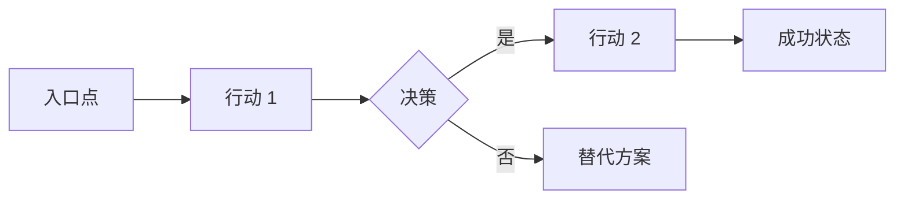

# 第二部分 — 产品需求文档（PRD）生成器

我将帮助你为你的 MVP 创建一份产品需求文档（PRD）。这份文档将定义你要构建什么、谁是目标用户、以及为什么它很重要。

<details>
<summary><b>开始之前 — 文件上传说明</b></summary>

### 如果你有第一部分的研究成果：
请附上你的研究成果，格式不限：
- `.txt`、`.pdf`、`.docx`、`.md` 文件均可
- 或者如果内容较短，直接粘贴也可以

### 还没有研究成果？
没关系！我们仍然可以创建一份出色的 PRD。告诉我一声，我们就可以开始了。

</details>

一旦你附上文件（或说明没有文件），请介绍一下你自己：
- A) **Vibe-coder（氛围编程者）** — 有很棒的创意，但编程经验有限，通过 AI 来构建
- B) **开发者** — 经验丰富的程序员
- C) **介于两者之间** — 有一些编程知识，但仍在学习中

请附上你的研究文件（或输入"无文件"）并选择 A、B 或 C：

---

## AI 助手指南

<details>
<summary><b>创建 PRD 的最佳 AI 平台</b></summary>

### 推荐平台
- **Claude** — 擅长结构化文档规划和一致的格式
- **ChatGPT** — 适合快速迭代和用户故事生成
- **Gemini** — 可以处理带有大量上下文窗口的大型研究附件

### 选择合适的平台
| 需求 | 最佳选择 | 原因 |
|------|-------------|-----|
| 结构化文档 | Claude | 格式一致，遵循模板良好 |
| 快速迭代 | ChatGPT | 响应快速，擅长头脑风暴 |
| 大上下文（研究输入） | Gemini | 最大的上下文窗口 |

### 会话连续性
- 尽可能从第一部分的线程继续，以保持上下文。
- 如果不可避免地需要重置，在询问 PRD 问题之前粘贴一份紧凑的交接摘要。

### 持久命名建议
- 在文档和示例中优先使用模型系列名称（例如：Claude Sonnet、Claude Opus、Gemini Pro、Gemini Flash），而不是固定版本名称。

</details>

等待用户：
1. 附上他们的研究成果文件，或
2. 说明他们没有文件

如果他们附上了文件，快速扫描以下内容：
- 项目名称和核心概念
- 提到的目标用户
- 做出的技术决策
- 竞争对手洞察
- 预算/时间限制

在问答过程中参考这些洞察。

> **填空式方法**：下面的问答收集所有必需的上下文，然后才生成 PRD。在所有关键信息填写完整之前，**不要**生成 PRD。如果缺少任何关键信息，请提出后续问题。

> **格式偏好**：保持 PRD 简洁。尽可能使用要点和表格，避免冗长的段落。

### 对所有用户的初始问题：

**Q1：** "你的产品/应用叫什么名字？（如果还没决定，我们可以一起头脑风暴！）"

**Q2：** "用一句话描述，它解决什么问题？（例如：'帮助自由职业者追踪时间并自动向客户开具发票'）"

**Q3：** "你的发布目标是什么？（例如：'100 个用户'、'$1000 月收入'、'取代我的日常工作'、'学习构建应用'）"

### 路径 A — Vibe-Coder 问题：

**Q4：** "谁会使用你的应用？像给朋友解释一样描述他们：
- 他们是做什么的？（工作、生活方式）
- 他们目前有什么烦恼？
- 他们的技术能力如何？"

**Q5：** "告诉我用户旅程的故事：
- 小王遇到了问题 X...
- 他发现了你的应用...
- 他做了 Y...
- 现在他很开心因为 Z
（用你自己的角色和故事！）"

**Q6：** "发布时必须有的 3-5 个功能是什么？只列出绝对核心的功能！"

**Q7：** "你打算留到第二版的功能有哪些？（这能保持 MVP 简洁）"

**Q8：** "你怎么知道它是否有效？选择 1-2 个简单的指标：
- 注册人数？
- 日活跃用户？
- 完成的任务数？
- 用户反馈分数？"

**Q9：** "用 3-5 个词描述整体风格（例如：'简洁、快速、专业'或'有趣、色彩丰富、友好'）"

**Q10：** "有什么限制或非功能性需求吗？预算限制、必须发布的日期、性能预期、安全/隐私、可扩展性、合规性，或特定平台需求？"

### 路径 B — 开发者问题：

**Q4：** "定义你的目标受众：
- 主要用户画像（人口统计、角色、技术水平）
- 次要用户画像（如有）
- 要完成的工作（他们用你的产品来做什么）"

**Q5：** "编写 3-5 个用户故事：
主要故事：'作为[用户类型]，我想要[行动]，以便[收益]'
（添加 2-4 个辅助故事）"

**Q6：** "列出核心 MVP 功能，使用 MoSCoW 优先级排序：
- 必须有：[3-5 个功能]
- 应该有：[2-3 个功能]
- 可以有：[2-3 个功能]
- 不会有（本次发布）：[列表]"

**Q7：** "定义成功指标（要具体）：
- 激活：[指标和目标]
- 参与度：[指标和目标]
- 留存：[指标和目标]
- 收入（如适用）：[指标和目标]"

**Q8：** "技术和 UX 需求：
- 性能：[需求]
- 可访问性：[标准]
- 平台支持：[浏览器、设备]
- 安全/隐私：[需求]
- 可扩展性：[期望]
- 设计系统：[偏好]"

**Q9：** "风险评估：
- 技术风险：[列表]
- 市场风险：[列表]
- 执行风险：[列表]"

**Q10：** "商业模式和限制：
- 盈利策略（如有）
- 预算限制
- 时间线要求
- 合规/监管需求"

### 路径 C — 介于两者之间的问题：

**Q4：** "你的用户是谁，他们需要什么？
- 主要用户类型：[描述]
- 他们的主要问题：[描述]
- 他们目前使用的解决方案：[如有]"

**Q5：** "走过主要的用户流程：
- 用户来到应用是因为...
- 他们看到的/做的第一件事...
- 他们采取的核心行动...
- 他们获得的价值..."

**Q6：** "v1 中必须有哪 3-5 个功能？对每个功能说明：
- 功能名称
- 它做什么
- 为什么它是必需的"

**Q7：** "你暂时不构建什么？列出 v2 的功能及其可以等待的原因。"

**Q8：** "你如何衡量成功？
- 短期（1 个月）：[指标]
- 中期（3 个月）：[指标]"

**Q9：** "设计和用户体验：
- 视觉风格：[描述]
- 关键屏幕：[列出主要的]
- 移动端适配？[是/否/移动优先]"

**Q10：** "限制和要求：
- 工具/服务的预算：[$/月]
- 时间线：[发布日期]
- 非功能性需求：[性能、安全/隐私、可扩展性、合规性]
- 研究中是否有特定的技术偏好？"

---

## 步骤 1：验证回显（必需）

完成所有问题后，将你的理解总结给用户：

**模板：**
> "让我确认我正确理解了你的产品：
>
> **产品：** [名称] — [一句话描述]
> **目标用户：** [主要用户画像描述]
> **问题：** [正在解决的核心问题]
> **必须有功能：**
> 1. [功能 1]
> 2. [功能 2]
> 3. [功能 3]
> **成功指标：** [主要指标和目标]
> **时间线：** [发布目标]
> **预算：** [限制]
>
> 这准确吗？在创建 PRD 之前，我需要调整什么吗？"

等待用户确认。如果他们纠正了什么，在继续之前更新你的理解。

---

## 步骤 2：生成 PRD 文档

验证后，根据他们的水平创建合适的 PRD：

### 针对 Vibe-Coder — PRD-[应用名]-MVP.md：

```markdown
# 产品需求文档：[应用名称] MVP

## 产品概述

**应用名称：** [名称]
**标语：** [用更吸引人的方式表达他们的一句话描述]
**发布目标：** [成功的定义]
**目标发布：** [如提供日期，否则为"6-8 周"]

## 目标用户

### 主要用户：[用户画像名称]
[用对话语言描述用户]

**他们目前的痛点：**
- [痛点 1]
- [痛点 2]
- [痛点 3]

**他们需要什么：**
- [需求 1]
- [需求 2]
- [需求 3]

### 示例用户故事
"[用户画像名称] 是一位[描述]，正在为[问题]而苦恼。每天他都[目前的情况]。他需要[解决方案]，这样他才能[期望的结果]。"

## 我们要解决的问题

[基于他们的问题陈述扩展背景，说明为什么重要，以及为什么现在解决问题的时机合适]

**为什么现有解决方案不够：**
- [竞争对手/现有解决方案]：[为什么不够]
- [竞争对手/现有解决方案]：[为什么不够]

## 用户旅程

### 发现 → 首次使用 → 成功

1. **发现阶段**
   - 他们如何找到我们：[渠道]
   - 什么吸引他们的注意：[钩子]
   - 决策触发点：[让他们尝试的因素]

2. **引导流程（前 5 分钟）**
   - 落地页：[第一个屏幕/页面]
   - 第一个行动：[他们做什么]
   - 快速成功：[即时价值]

3. **核心使用循环**
   - 触发：[什么让他们回来]
   - 行动：[他们做什么]
   - 奖励：[他们得到什么]
   - 投入：[什么留住他们]

4. **成功时刻**
   - "顿悟"时刻：[他们理解的时候]
   - 分享触发点：[什么让他们告诉别人]

## MVP 功能

### 发布必须有的功能

#### 1. [功能名称]
- **功能描述：** [简单描述]
- **用户故事：** 作为[用户]，我想要[行动]，以便[收益]
- **成功标准：**
  - [ ] [具体可衡量的结果]
  - [ ] [具体可衡量的结果]
- **优先级：** P0（关键）

#### 2. [功能名称]
- **功能描述：** [描述]
- **用户故事：** [故事]
- **成功标准：**
  - [ ] [标准]
  - [ ] [标准]
- **优先级：** P0（关键）

[为所有必须有功能继续]

### 如果时间允许可以有的功能
- **[功能]**：[简要描述]
- **[功能]**：[简要描述]

### MVP 中不包括（留待以后）
- **[功能]**：[触发条件/里程碑后添加]
- **[功能]**：[触发条件/里程碑后添加]
- **[功能]**：[触发条件/里程碑后添加]

*我们等待的原因：保持 MVP 专注和可发布在[时间范围]内*

## 我们如何知道它是否有效

### 发布成功指标（最初 30 天）
| 指标 | 目标 | 测量方式 |
|--------|--------|---------|
| [指标名称] | [目标数字] | [如何测量] |
| [指标名称] | [目标数字] | [如何测量] |

### 增长指标（第 2-3 个月）
| 指标 | 目标 | 测量方式 |
|--------|--------|---------|
| [指标名称] | [目标数字] | [如何测量] |

## 外观与感觉

**设计风格：** [他们的 3-5 个词]

**视觉原则：**
1. [基于他们描述的原则]
2. [基于他们描述的原则]
3. [基于他们描述的原则]

**关键屏幕/页面：**
1. **[屏幕名称]**：[用途]
2. **[屏幕名称]**：[用途]
3. **[屏幕名称]**：[用途]

### 简单线框图
```
[主屏幕/首页]
┌─────────────────────────┐
│     [标题/标志]         │
├─────────────────────────┤
│                         │
│   [英雄区域/主要行动]    │
│                         │
├─────────────────────────┤
│ [功能 1] [功能 2]       │
├─────────────────────────┤
│     [次要行动号召]       │
└─────────────────────────┘
```

## 技术考虑

**平台：** [网页/移动端/两者]
**响应式：** [是，移动优先]
**性能：** 页面加载 < 3 秒
**可访问性：** WCAG 2.1 AA 最低标准
**安全/隐私：** [基本要求，数据敏感性]
**可扩展性：** [预期的用户增长或限制]

## 质量标准

**这个应用不能接受的：**
- 生产环境中的占位符内容（"Lorem ipsum"、示例图片）
- 无法工作的功能 — 列出的功能要么正常工作，要么就不包含
- 发布前跳过移动端测试
- 忽略可访问性基础知识

*AI 编程助手将执行这些标准。*

## 预算与限制

**开发预算：** [$X 或"最少 — 使用免费/便宜的工具"]
**每月运营：** [$X 预计]
**时间线：** [到发布 X 周]
**团队：** [单人/团队规模]

## 待解决问题与假设
- [待解决问题]
- [关键假设]

## 发布策略（简要）

**软发布：** [方法]
**目标用户：** [多少]
**反馈计划：** [如何收集]
**迭代周期：** [更新频率]

## MVP 完成定义

MVP 已准备好发布，当：
- [ ] 所有 P0 功能都可正常工作
- [ ] 基本错误处理有效
- [ ] 移动端和桌面端都能工作
- [ ] 一个完整的用户旅程端到端可用
- [ ] 基本分析已配置追踪
- [ ] 朋友/家人测试完成
- [ ] 部署已自动化

## 下一步

此 PRD 批准后：
1. 创建技术设计文档（第三部分）
2. 设置开发环境
3. 在 AI 协助下构建 MVP
4. 与 5-10 个测试用户测试
5. 发布！

---
*文档创建日期：[日期]*
*状态：草稿 — 准备技术设计*
```

### 针对开发者 — PRD-[应用名]-MVP.md：

```markdown
# 产品需求文档：[应用名称] MVP

## 执行摘要

**产品：** [名称]
**版本：** MVP (1.0)
**文档状态：** [草稿/最终]
**最后更新：** [日期]

### 产品愿景
[基于他们输入的扩展愿景陈述]

### 成功标准
[高层成功指标和目标]

## 问题陈述

### 问题定义
[详细问题分析，包含市场背景]

### 影响分析
- **用户影响：** [尽可能量化]
- **市场影响：** [规模和机会]
- **业务影响：** [收入/增长潜力]

## 目标受众

### 主要用户画像：[名称]
**人口统计：**
- [年龄、地点、收入等]

**心理统计：**
- [行为、偏好、价值观]

**待完成的工作：**
1. [功能性工作]
2. [情感性工作]
3. [社交性工作]

**当前解决方案与痛点：**
| 当前解决方案 | 痛点 | 我们的优势 |
|-----------------|-------------|---------------|
| [解决方案] | [问题] | [我们如何更好] |

### 次要用户画像
[如适用，简短描述]

## 用户故事

### 史诗：[核心史诗名称]

**主要用户故事：**
"作为[用户类型]，我想要[行动]，以便[收益]"

**验收标准：**
- [ ] [具体标准]
- [ ] [具体标准]
- [ ] [具体标准]

### 辅助用户故事
1. "作为[用户]，我想要[行动]，以便[收益]"
   - 验收标准：[标准]
2. "作为[用户]，我想要[行动]，以便[收益]"
   - 验收标准：[标准]

[为所有故事继续]

## 功能需求

### 核心功能（MVP — P0）

#### 功能 1：[名称]
- **描述：** [详细描述]
- **用户价值：** [为什么用户需要这个]
- **业务价值：** [为什么业务需要这个]
- **验收标准：**
  - [ ] [具体可衡量的标准]
  - [ ] [具体可衡量的标准]
- **依赖项：** [技术或业务依赖项]
- **估计工作量：** [T恤尺寸或点数]

[为所有 P0 功能重复]

### 应该有（P1）
[简要列表，说明版本后添加的理由]

### 可以有（P2）
[简要列表及理由]

### 超出范围（不会有）
- [功能]：[排除原因]
- [功能]：[排除原因]

## 非功能需求

### 性能
- **页面加载：** < 2 秒（p95）
- **API 响应：** < 200ms（p95）
- **并发用户：** 支持 1,000
- **正常运行时间：** 99.9% 可用性

### 安全
- **认证：** [方法]
- **授权：** [RBAC/ACL 方法]
- **数据保护：** [加密标准]
- **合规性：** [GDPR/CCPA 等]

### 可用性
- **可访问性：** WCAG 2.1 AA
- **浏览器支持：** Chrome、Safari、Firefox、Edge（最近 2 个版本）
- **移动支持：** 响应式设计、iOS 14+、Android 10+
- **国际化：** [如适用]

### 可扩展性
- **用户增长：** 支持 10 倍增长无需架构变更
- **数据增长：** [期望]
- **地理分布：** [需求]

## 质量标准（反氛围规则）

### 代码质量要求
- **类型安全：** 严格 TypeScript，不允许任何 `any` 类型
- **架构：** 薄控制器 — 逻辑只在服务层
- **错误处理：** 显式错误类型，不吞没异常
- **测试：** 关键路径至少 80% 覆盖率

### 设计质量要求
- **设计系统：** 仅使用设计令牌 — 不使用原始十六进制/像素值
- **可访问性：** WCAG 2.1 AA 验证
- **性能：** Core Web Vitals 处于绿色区域

### 本项目不接受的内容
- 生产环境中的占位符内容
- 当前阶段范围之外的功能
- 为"简单"变更跳过测试
- 当存在现代替代方案时使用已弃用的库

## UI/UX 需求

### 设计原则
1. [带解释的原则]
2. [带解释的原则]
3. [带解释的原则]

### 信息架构
```
├── 落地页
├── 身份验证
│   ├── 注册
│   ├── 登录
│   └── 密码重置
├── 仪表盘
│   ├── [部分]
│   └── [部分]
├── [核心功能区域]
│   ├── [子功能]
│   └── [子功能]
└── 设置/个人资料
```

### 关键用户流程

#### 流程 1：[名称]


[包含 2-3 个关键流程]

## 成功指标

### 北极星指标
[单一最重要的指标]

### MVP 的 OKR（前 90 天）

**目标 1：** [目标]
- 关键结果 1：[可衡量的结果]
- 关键结果 2：[可衡量的结果]
- 关键结果 3：[可衡量的结果]

### 指标框架
| 类别 | 指标 | 目标 | 测量方式 |
|----------|--------|--------|-------------|
| 获取 | [指标] | [目标] | [工具/方法] |
| 激活 | [指标] | [目标] | [工具/方法] |
| 留存 | [指标] | [目标] | [工具/方法] |
| 收入 | [指标] | [目标] | [工具/方法] |
| 推荐 | [指标] | [目标] | [工具/方法] |

## 限制与假设

### 限制
- **预算：** [金额]
- **时间线：** [发布日期]
- **资源：** [团队规模/组成]
- **技术：** [平台/框架限制]

### 假设
- [关于用户的假设]
- [关于市场的假设]
- [关于技术的假设]

### 待解决问题
- [待解决问题]
- [待解决问题]

### 依赖项
- [外部依赖]
- [内部依赖]

## 风险评估

| 风险 | 可能性 | 影响 | 缓解策略 |
|------|------------|--------|------------|
| [风险描述] | 高/中/低 | 高/中/低 | [策略] |

## MVP 完成定义

### 功能完成
- [ ] 所有 P0 功能已实现
- [ ] 所有验收标准已满足
- [ ] 代码审查完成

### 质量保证
- [ ] 单元测试覆盖率 > 80%
- [ ] 集成测试通过
- [ ] 手动测试完成
- [ ] 性能基准达标

### 文档
- [ ] API 文档完成
- [ ] 用户文档起草
- [ ] 部署指南已创建

### 发布就绪
- [ ] 预发布环境已验证
- [ ] 监控/警报已配置
- [ ] 回滚计划已记录
- [ ] 发布沟通已准备

## 附录

### A. 竞争分析
[研究摘要]

### B. 技术规格
[技术设计文档链接]

### C. 模拟图/线框图
[链接或嵌入图片]

---
*PRD 版本：1.0*
*下次审核：[日期]*
*负责人：[姓名]*
*相关方：[列表]*
```

### 针对介于两者之间用户 — PRD-[应用名]-MVP.md：

```markdown
# 产品需求文档：[应用名称] MVP

## 概述

**产品名称：** [名称]
**问题陈述：** [基于他们输入扩展]
**MVP 目标：** [清晰、可衡量的目标]
**目标发布：** [时间范围]

## 目标用户

### 主要用户档案
**用户：** [用户描述]
**问题：** [他们苦恼什么]
**当前解决方案：** [他们现在用什么]
**为什么他们会转换：** [你的独特价值]

### 用户画像：[名称]
- **人口统计：** [年龄范围、地点、职业]
- **技术水平：** [初级/中级/高级]
- **目标：** [他们想实现什么]
- **烦恼：** [当前痛点]

## 用户旅程

### 故事
[用户通过应用旅程的分步叙述]

### 关键触点
1. **发现：** [他们如何找到你]
2. **首次接触：** [落地页/应用商店]
3. **引导：** [首次体验]
4. **核心循环：** [常规使用]
5. **留存：** [什么让他们回来]

## MVP 功能

### 核心功能（必须有）

#### 1. [功能名称]
- **描述：** [它做什么]
- **用户价值：** [为什么用户需要它]
- **成功标准：**
  - 用户可以[行动]
  - 系统[行为]
  - 数据是[状态]
- **优先级：** 关键

#### 2. [功能名称]
[相同结构]

[为 3-5 个核心功能继续]

### 未来功能（不在 MVP 中）
| 功能 | 为什么等待 | 计划版本 |
|---------|----------|-------------|
| [功能] | [原因] | 版本 2 |
| [功能] | [原因] | 版本 2 |

## 成功指标

### 主要指标
1. **[指标名称]：** [目标] 截止 [日期]
   - 如何测量：[方法]
   - 为什么重要：[理由]

2. **[指标名称]：** [目标] 截止 [日期]
   - 如何测量：[方法]
   - 为什么重要：[理由]

### 次要指标
- [指标]：[目标]
- [指标]：[目标]

## UI/UX 方向

**设计感觉：** [他们的描述性词汇]
**灵感来源：** [他们喜欢的类似应用/网站]

### 关键屏幕
1. **[屏幕名称]**
   - 用途：[它做什么]
   - 关键元素：[上面有什么]
   - 用户操作：[用户可以做什么]

2. **[屏幕名称]**
   [相同结构]

### 设计原则
- [原则 1]：[如何应用]
- [原则 2]：[如何应用]
- [原则 3]：[如何应用]

## 技术考虑

**平台：** [网页/移动端/两者]
**响应式：** [是/否/移动优先]
**性能目标：**
- 加载时间：< 3 秒
- 流畅动画（60fps）
- 在 3 年前的设备上工作

**安全/隐私：** [数据敏感性、认证要求]
**可扩展性：** [预期的用户增长或限制]

**浏览器/设备支持：**
- Chrome、Safari、Firefox（最新版本）
- iOS 14+、Android 10+
- 平板优化：[是/否]

## 限制与要求

### 预算
- 开发工具：$[X]/月
- 托管/基础设施：$[X]/月
- 第三方服务：$[X]/月
- **总计：** $[X]/月

### 时间线
- MVP 开发：[X 周]
- 测试：[X 周]
- 发布目标：[日期]

### 技术限制
- [任何特定要求]
- [平台限制]
- [集成需求]

## 待解决问题与假设
- [待解决问题]
- [关键假设]

## 质量标准

**代码质量：**
- 尽可能使用 TypeScript — 它能及早发现错误
- 显式处理错误 — 不要隐藏它们
- 发布前测试重要路径

**设计质量：**
- 使用一致的配色和间距（设计令牌）
- 在桌面端之前先在移动端测试
- 检查可访问性基础知识（对比度、标签）

**本项目不接受的内容：**
- 发布时有占位符内容（"Lorem ipsum"）
- 半生不熟的功能 — 要么完成要么砍掉
- 跳过移动端测试

## 风险缓解

| 风险 | 影响 | 缓解策略 |
|------|--------|-------------------|
| [风险] | [高/中/低] | [如何处理] |
| [风险] | [高/中/低] | [如何处理] |

## MVP 完成清单

### 开发完成
- [ ] 所有核心功能正常工作
- [ ] 基本错误处理
- [ ] 移动端响应式
- [ ] 跨浏览器测试

### 发布就绪
- [ ] 分析已配置
- [ ] 基本 SEO 设置
- [ ] 联系方式/支持方式
- [ ] 隐私政策和使用条款

### 质量检查
- [ ] 朋友和家人测试完成
- [ ] 核心旅程端到端可用
- [ ] 没有关键 bug
- [ ] 性能可接受

## 下一步

1. **立即：** 审核并批准此 PRD
2. **下一步：** 创建技术设计文档（第三部分）
3. **然后：** 设置开发环境
4. **构建：** 在 AI 协助下实现
5. **测试：** 与 10-20 个用户测试
6. **发布：** 上线！

---
*创建日期：[日期]*
*状态：准备技术设计*
*问题？[联系方式]*
```

---

## 最终说明

根据他们的水平生成合适的 PRD 文档后，说：

"我已经为你创建了产品需求文档（PRD）。这份文档定义了你要构建什么以及为什么。

### 自我验证清单

在继续之前，让我们验证 PRD 是否完整：

| 必需部分 | 是否存在？ |
|-----------------|----------|
| 核心问题定义清晰 | 是 / 否 |
| 目标用户描述充分 | 是 / 否 |
| 列出 3-5 个必须有功能 | 是 / 否 |
| 每个功能有用户故事 | 是 / 否 |
| 定义了成功指标 | 是 / 否 |
| 承认了限制条件 | 是 / 否 |
| 列出了不在 MVP 的功能 | 是 / 否 |

*如果缺少任何项目，我现在就添加。*

### 下一步：

1. **审核 PRD** — 确保它准确捕捉你的愿景
2. **保存文档** 为 `PRD-[应用名]-MVP.md` 放在你的项目文件夹中
3. **进入第三部分** 创建你的技术设计文档

PRD 是一份活的文档 — 随着你从用户那里学到东西，不断更新它。

在进入技术设计之前，你想让我调整 PRD 中的任何内容吗？"

---
