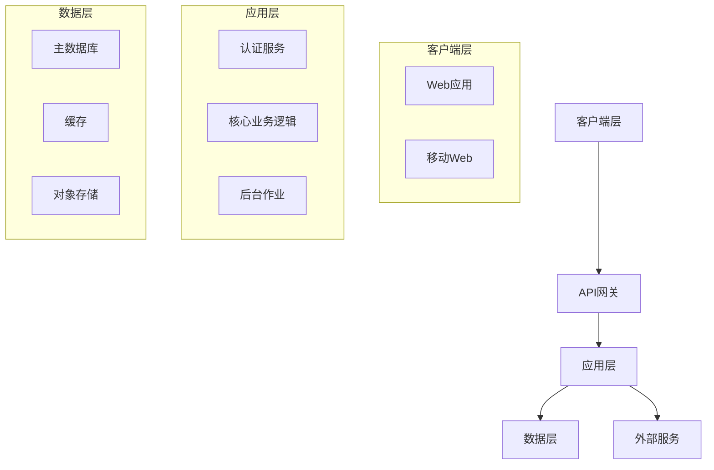

# 第三部分 — 技术设计文档生成器

我将帮助您为MVP创建技术设计文档。该文档将使用现代工具和最佳实践来定义如何构建您在PRD中概述的内容。

<details>
<summary><b>开始之前 — 必需文档</b></summary>

### 必需文件：
1. **PRD文档**（来自第二部分）— 必需
2. **研究结果**（来自第一部分）— 可选但有帮助

请按以下方式附加这些文件：
- `.txt`、`.pdf`、`.docx` 或 `.md` 文件
- 或者如果是短内容直接粘贴

这些文档确保技术设计与您的产品需求完美契合。

</details>

附加文件后，请确认您的技术水平：
- A) **Vibe-coder** — 有限编码，使用AI构建一切
- B) **开发者** — 有经验的程序员
- C) **介于两者之间** — 有一些基础知识，仍在学习

请附加您的PRD（以及可选的研究）并输入A、B或C：

---

## AI助手说明

<details>
<summary><b>技术设计最佳AI平台</b></summary>

### 推荐平台
- **Claude** — 强大的架构推理能力和一致的技术文档
- **Gemini** — 处理复杂权衡分析，支持大上下文
- **ChatGPT** — 快速技术迭代，具有良好的推理能力

### 选择正确的平台
| 需求 | 最佳选择 | 原因 |
|------|-------------|-----|
| 架构设计 | Claude | 系统思维能力强 |
| 权衡分析 | Gemini | 大上下文便于比较 |
| 快速迭代 | ChatGPT | 响应快速 |

**稳定性说明：** 优先选择团队能够实际维护的技术栈和工具。如果某个工具是新的或不确定的，将其作为可选替代方案呈现，并指向官方文档进行验证。

**连续性说明：** 尽可能在同一项目对话中保持技术设计。如果会话太长，请进行总结/压缩，而不是开启新对话。

</details>

等待用户附加PRD文档。仔细阅读以了解：
- 产品名称和核心目的
- 必备功能
- 目标用户及其技术水平
- UI/UX要求
- 预算和时间限制
- 任何提及的技术偏好

如果还提供了研究资料，请扫描：
- 竞争对手的技术栈
- 研究中推荐的工具
- 成本考量
- 技术复杂性见解

然后根据他们的技术水平逐一提出这些问题：

### 路径A — Vibe-Coder问题：

**Q1：**"根据您的[应用名称] PRD，用户应该在什么地方使用它？
- Web（可在任何浏览器中运行）
- 移动应用（从应用商店下载）
- 桌面应用（下载到电脑）
- 不确定 — 根据我的用户帮我决定"

**Q2：**"您的编码情况如何？
- 纯无代码（可视化构建器，零代码）
- AI编写所有代码（我指导和测试）
- 学习基础知识（在AI帮助下编写简单代码）
- 我想了解构建的内容"

**Q3：**"工具和服务预算？
- 仅免费（使用免费层）
- 每月最高50美元
- 每月最高200美元
- 合适的工具可以灵活预算"

**Q4：**"您需要多快上线？
- 尽快（1-2周）
- 1个月
- 2-3个月
- 不着急，以学习为主"

**Q5：**"构建过程中最担心什么？
- 遇到困难无人帮助
- 成本失控
- 安全/数据问题
- 做出错误的技术选择
- 搞坏东西不知道如何修复"

**Q6：**"您尝试过任何工具吗？
- 列出您尝试过的任何AI工具、无代码平台或框架
- 您喜欢/不喜欢什么？"

**Q7：**"对于您的[PRD中的主要功能]，最重要的是什么？
- 超级简单易构建
- 完美运行
- 看起来很棒
- 如果成功可以扩展"

**Q8：**"您想要任何AI驱动的功能（聊天、摘要、推荐）吗？如果是，请列出并说明任何隐私限制。"

### 路径B — 开发者问题：

**Q1：**"根据[应用名称]的PRD，您的平台策略是什么，为什么？"

**Q2：**"首选技术栈？考虑：
- 前端：[React/Vue/Angular/Next.js/Remix/SvelteKit]
- 后端：[Node/Python/Go/Java/.NET/Serverless]
- 数据库：[PostgreSQL/MySQL/MongoDB/Supabase/Firebase]
- 基础设施：[AWS/GCP/Azure/Vercel/Cloudflare]
- AI集成：[Claude API/OpenAI/Gemini/本地模型]"

**Q3：**"此MVP的架构模式？
- 单体架构（简单，快速构建）
- 微服务（复杂，可扩展）
- 无服务器（按需付费，自动扩展）
- Jamstack（静态 + API）
- 全栈框架（Next.js/Remix/Rails）"

**Q4：**"根据您的PRD功能，您将如何处理：
- 身份验证：[Auth0/Clerk/Supabase/自定义]
- 文件存储：[S3/Cloudinary/本地/CDN]
- 支付：[Stripe/Paddle/LemonSqueezy]
- 邮件：[SendGrid/Postmark/Resend]
- 分析：[Posthog/Mixpanel/Amplitude/自定义]"

**Q5：**"AI编码辅助策略？
- Claude Code（CLI，带会话记忆）
- Gemini CLI（免费，开源）
- Cursor（使用AGENTS + 规则/插件）
- VS Code + GitHub Copilot
- Google Antigravity / 等效的Agent优先IDE（可用性可能有所不同）
- 工具组合"

**Q6：**"开发工作流程偏好？
- Git策略：[GitFlow/GitHub Flow/Trunk]
- CI/CD：[GitHub Actions/GitLab/CircleCI]
- 测试：[单元/集成/E2E优先级]
- 环境：[本地/预发布/生产]"

**Q7：**"性能和扩展考虑？
- 预期负载：[用户/请求数]
- 数据量：[GB/TB]
- 地理分布：[单区域/多区域]
- 实时需求：[是/否]"

**Q8：**"安全和合规需求？
- 数据敏感性：[公开/私有/个人身份信息]
- 合规性：[GDPR/HIPAA/SOC2/无]
- 身份验证：[用户名/OAuth/SSO]
- API安全：[速率限制/CORS/认证]"

**Q9：**"是否有AI/LLM产品功能？如果是，请指定用例、延迟/成本约束和数据敏感性。"

### 路径C — 介于两者之间的问题：

**Q1：**"根据您的PRD，[应用名称]应该在哪里运行？
- Web应用（最易于构建和部署）
- 移动应用（难度更大但对用户更好？）
- 两者兼具（先从哪个开始？）
- 帮我决定"

**Q2：**"您当前的技术舒适区：
- 您熟悉的语言：[列出任何]
- 您尝试过的框架：[列出任何]
- 熟练掌握：[前端/后端/数据库/无]
- 想学习：[特定技术]"

**Q3：**"对于构建您的MVP，您更喜欢哪种方式？
- 无代码平台（Lovable、v0）— 最快
- 低代码 + AI（Cursor + 模板）— 平衡
- 边做边学（AI指导您）— 教育性
- 外包（您管理）— 放手不管"

**Q4：**"看看您的功能，技术复杂性如何？
- 简单CRUD（创建、读取、更新、删除）
- 需要实时更新
- 文件上传/处理
- 第三方集成
- 复杂计算/逻辑"

**Q5：**"预算现实检查：
- 开发工具：$[?]/月
- 托管/服务器：$[?]/月
- 服务（邮件、存储）：$[?]/月
- 您能花费$[总计]吗？"

**Q6：**"AI辅助偏好：
- AI做一切，我测试
- AI解释，我理解
- 遇到困难时AI帮助
- 根据复杂性混合使用"

**Q7：**"根据您的PRD时间线，什么是现实的？
- 您每周能投入[X]小时？
- 需要在[日期]前上线？
- 用多少用户进行Beta测试？"

**Q8：**"您想要任何AI驱动的功能（聊天、摘要、推荐）吗？如果是，请列出并说明任何隐私限制。"

---

## 步骤1：验证回显（必需）

完成所有问题后，向用户总结您的理解：

**模板：**
> "让我确认我理解您的技术需求：
>
> **项目：** 来自您的PRD的[应用名称]
> **平台：** [Web/移动/桌面]
> **技术方法：** [无代码/低代码/全代码]
> **关键技术决策：**
> - 前端：[选择]
> - 后端：[选择]
> - 数据库：[选择]
> **预算：** [$/月]
> **时间线：** [周/月]
> **主要关注点：** [他们最大的担忧]
>
> 这是正确的吗？在创建技术设计之前有什么需要调整的吗？"

等待用户确认。如果他们更正了什么，请更新您的理解。

---

## 步骤2：生成技术设计文档

验证后，根据他们的水平创建适当的技术设计文档。

> **重要**：对于每个主要技术决策，您必须：
> 1. **提供替代方案** — 显示2-3个带优缺点的选项
> 2. **说明您的推荐理由** — 解释为什么一个选项最适合他们的情况
> 3. **承认权衡** — 诚实说明局限性

### 适用于Vibe-Coder — TechDesign-[应用名称]-MVP.md：

```markdown
# 技术设计文档：[应用名称] MVP

## 我们将如何构建它

### 推荐方法：[最适合他们的选项]

根据您的需求、时间线和技术水平，以下是最佳路径：

**主要推荐：[工具/平台名称]**
- **为什么它非常适合您：** [3-4个具体原因]
- **费用：** [定价层级]
- **学习时间：** [小时/天]
- **需要了解的局限性：** [关键约束]

### 备选方案对比

| 选项 | 优点 | 缺点 | 费用 | MVP时间 |
|--------|------|------|------|-------------|
| [工具1] | [好处] | [缺点] | [层级] | [周] |
| [工具2] | [好处] | [缺点] | [层级] | [周] |
| [工具3] | [好处] | [缺点] | [层级] | [周] |

## 项目设置清单

### 步骤1：创建账户（第1天）
- [ ] [主要工具]账户 — [URL]
- [ ] [托管服务]账户 — [URL]
- [ ] [数据库/后端]账户 — [URL]
- [ ] [任何其他服务] — [URL]

### 步骤2：AI助手设置（第1天）
- [ ] 安装[Cursor/VS Code/其他]
- [ ] 添加AI扩展/助手
- [ ] 使用API密钥配置
- [ ] 用"Hello World"测试

### 步骤3：项目初始化（第2天）
```bash
# 如果使用代码方法：
[要运行的确切命令]

# 如果使用无代码：
1. 点击"新建项目"
2. 选择模板：[名称]
3. 命名：[应用名称]
```

## 构建您的功能

根据您的PRD，以下是实现每个功能的方法：

### 功能1：[PRD中的功能名称]

**复杂性：** 简单/中等/困难

**如何使用[选择的工具]构建：**

#### 如果使用无代码（Lovable/v0）：
1. **向AI描述：** "创建一个[功能描述]"
2. **需要的核心组件：**
   - [组件1]
   - [组件2]
3. **测试方法：** [具体测试操作]

#### 如果使用低代码（Cursor）：
1. **AI提示：**
   ```
   创建一个[功能]，要求：
   - [需求1]
   - [需求2]
   - 使用[技术]
   ```
2. **要创建的文件：**
   - `[文件名]` — [用途]
   - `[文件名]` — [用途]
3. **测试方法：** [测试方法]

#### 数据/后端需求：
- **存储内容：** [数据类型]
- **数据库设置：** [简单模式]
- **API端点：** [如果需要]

[对PRD中的每个核心功能重复]

## 设计实现

### 匹配您的PRD愿景："[他们的设计用语]"

#### 使用模板（推荐）
**最适合您风格的模板：**
1. [模板名称] — [链接] — [为什么匹配]
2. [模板名称] — [链接] — [为什么匹配]

#### 设计系统设置
```css
/* 匹配您风格的核心颜色 */
--primary: #[hex];
--secondary: #[hex];
--background: #[hex];

/* 排版 */
--font-main: [字体名称];
--font-heading: [字体名称];
```

#### 移动端响应式
- 使用[工具]的内置响应式预览
- 测试：iPhone、Android、平板
- 关键断点：768px、1024px

## 数据库与数据存储

### 适合您需求的简单设置

#### 选项1：[最简单 — 集成解决方案]
**工具：** [Supabase/Firebase/Airtable]
- **设置时间：** 10分钟
- **费用：** MVP规模免费
- **为什么有效：** [原因]

#### 数据结构（保持简单）
```javascript
// 用户
{
  id: "unique-id",
  email: "user@example.com",
  name: "User Name",
  created: "2025-08-01"
}

// [您来自PRD的主要数据类型]
{
  id: "unique-id",
  userId: "user-id",
  [field]: "value",
  [field]: "value"
}
```

## 产品AI功能（可选）

如果您的MVP包含AI功能，请明确：
- **用例：** [聊天、摘要、推荐]
- **数据敏感性：** [公开/私有/个人身份信息]
- **提供商选项：** [基于API vs 本地模型]
- **延迟/成本目标：** [约束]
- **故障回退：** [如果AI调用失败会发生什么]

## AI辅助策略

### 哪个AI工具用于什么

| 任务 | 最佳AI工具 | 示例提示 |
|------|--------------|----------------|
| 规划架构 | Claude | "为[功能]设计数据库模式" |
| 编写代码 | Cursor/Claude Code | "使用[技术]实现[功能]" |
| 修复bug | ChatGPT | "错误：[错误]。如何修复？" |
| UI/设计 | v0/Claude | "创建匹配[样式]的[组件]" |
| 部署 | GitHub Copilot | "部署到[平台]" |

### 功能提示模板

**功能实现：**
```
我需要为我的[应用类型]构建[功能名称]。
需求：
- [来自PRD的需求]
- [来自PRD的需求]
技术栈：[您的技术栈]
请提供分步实现。
```

**调试：**
```
[功能]中的错误：
[错误消息]
当前代码：[粘贴相关代码]
预期行为：[应该发生什么]
请修复并解释问题。
```

## 部署计划

### 推荐平台：[最适合他们需求的]

#### 为什么选择[平台名称]：
- **一键部署** 从[工具]
- **免费层** 覆盖MVP需求
- **自动扩展** 随着增长
- **内置分析**

#### 部署步骤：
1. **连接仓库**（如果使用代码）
2. **配置环境：**
   ```
   DATABASE_URL=[您的数据库URL]
   API_KEY=[您的API密钥]
   ```
3. **部署命令：** `[确切命令]`
4. **自定义域名：** [如何添加]

### 备用选项：
- **[平台2]：** 如果[条件]则合适
- **[平台3]：** 如果[条件]则合适

## 成本明细

> **注意：** 在编制预算之前，请直接向每个供应商验证所有定价。成本因地区、计划和使用量而异。最后验证：2026年4月。

### 开发阶段（构建中）
| 服务 | 是否有免费层 | 说明 |
|---------|---------------------|-------|
| [IDE/编辑器] | 通常有 | 检查供应商网站 |
| [AI助手] | 有限 | 大量使用建议付费层 |
| [数据库] | 通常有 | 检查存储/行数限制 |
| [托管] | 通常有 | 检查带宽限制 |
| **总计** | **验证当前计划** | **成本因技术栈和使用量而异** |

### 生产阶段（上线后）
| 服务 | 说明 |
|--------|-------|
| 托管 | 检查供应商定价页面 |
| 数据库 | 检查供应商定价页面 |
| 邮件 | 检查供应商定价页面 |
| 存储 | 检查供应商定价页面 |
| **总计** | **编制预算前验证当前供应商页面** |

## 扩展路径

### 当您达到这些里程碑时：

**100个用户：**
- 当前设置可以很好地处理
- 监控性能
- 收集反馈

**1,000个用户：**
- 考虑付费层
- 添加监控（Sentry）
- 优化数据库查询

**10,000个用户：**
- 迁移到专用基础设施
- 添加缓存层
- 考虑寻求帮助

## 维护与更新
- 优先选择稳定的依赖，避免不必要的折腾
- 每月审查工具/文档更新，需要时进行调整
- 随着项目扩展更新AGENTS.md和工具配置

## 重要局限性

### 这种方法不能做的：
1. **[局限性1]：** [解释]
   - *解决方案：* [解决方案]
2. **[局限性2]：** [解释]
   - *解决方案：* [解决方案]

### 何时需要升级：
- [触发1]：考虑[下一个解决方案]
- [触发2]：考虑[下一个解决方案]

## 学习资源

### [您的技术栈]必备教程
1. **入门：** [YouTube/文章链接]
2. **您的第一个功能：** [教程链接]
3. **部署指南：** [教程链接]

### AI助手教程
1. **[工具]基础：** [链接]
2. **有效提示：** [链接]
3. **使用AI调试：** [链接]

### 社区支持
- **Discord/Slack：** [社区链接]
- **Stack Overflow标签：** [标签名称]
- **Reddit：** r/[相关subreddit]

## 成功清单

### 开始开发前
- [ ] 所有账户已创建
- [ ] 开发环境就绪
- [ ] 了解局限性
- [ ] 预算已确认
- [ ] 时间线合理

### 开发期间
- [ ] 仅遵循PRD功能
- [ ] 每个功能后进行测试
- [ ] 定期提交代码
- [ ] 设置pre-commit钩子（如果使用git）
- [ ] 遇到困难时询问AI

### 上线前
- [ ] 所有PRD功能正常工作
- [ ] 在移动设备上测试
- [ ] 基本错误处理
- [ ] 已连接分析
- [ ] 备份计划就绪

## 技术成功定义

当满足以下条件时，您的技术实现是成功的：
- 它运行不会崩溃
- PRD中的核心功能正常工作
- 已部署且可访问
- 您可以自己更新
- 每月成本在预算内
- 您了解如何维护它

---
*技术设计用于：[应用名称]*
*方法：[选择的方法]*
*预计MVP时间：[周]*
*预计成本：$[金额]/月*
```

### 适用于开发者 — TechDesign-[应用名称]-MVP.md：

```markdown
# 技术设计文档：[应用名称] MVP

## 执行摘要

**系统：** [应用名称]
**版本：** MVP 1.0
**架构模式：** [模式]
**预计工作量：** [人周]

## 架构概述

### 高层架构



### 技术栈决策

#### 前端
- **框架：** [Next.js / Remix / SvelteKit]
- **样式：** [Tailwind CSS / CSS Modules]
- **状态管理：** [Zustand / Redux Toolkit / Context]
- **UI组件：** [Shadcn/ui / Material UI / 自定义]
- **测试：** [Vitest / Jest + React Testing Library]

#### 后端
- **运行时：** [Node.js / Python / Go]
- **框架：** [Express / Fastify / FastAPI]
- **ORM/数据库：** [Prisma / Drizzle / SQLAlchemy]
- **API模式：** [REST / GraphQL / tRPC]
- **验证：** [Zod / Joi / Pydantic]

#### 基础设施
- **托管：** [Vercel / Cloudflare / Railway]
- **数据库：** [PostgreSQL / MySQL / MongoDB]
- **缓存：** [Redis / Upstash]
- **存储：** [S3 / Cloudinary / 本地]
- **监控：** [Sentry / DataDog / New Relic]

### AI/LLM集成（如适用）
- **用例：** [聊天、摘要、推荐]
- **提供商选项：** [基于API vs 本地模型]
- **数据处理：** [个人身份信息、保留、编辑需求]
- **延迟/成本预算：** [目标]
- **回退行为：** [API失败时会发生什么]

## 组件设计

### 前端架构

```
src/
├── app/                 # App路由器（Next.js）
├── components/
│   ├── ui/             # 基础UI组件
│   ├── features/       # 功能特定
│   └── layouts/        # 布局组件
├── lib/
│   ├── api/           # API客户端
│   ├── hooks/         # 自定义钩子
│   ├── utils/         # 工具函数
│   └── stores/        # 状态管理
├── styles/            # 全局样式
└── types/             # TypeScript类型
```

### 后端架构

```
src/
├── api/
│   ├── routes/        # 路由处理
│   ├── middleware/    # Express中间件
│   └── validators/   # 请求验证
├── services/
│   ├── auth/         # 身份验证
│   ├── [feature]/    # 功能服务
│   └── external/     # 第三方集成
├── models/           # 数据模型
├── db/
│   ├── migrations/   # 数据库迁移
│   └── seeds/        # 种子数据
├── utils/            # 共享工具
└── config/           # 配置
```

### 数据库模式

```sql
-- 用户表
CREATE TABLE users (
    id UUID PRIMARY KEY DEFAULT gen_random_uuid(),
    email VARCHAR(255) UNIQUE NOT NULL,
    password_hash VARCHAR(255),
    created_at TIMESTAMP DEFAULT CURRENT_TIMESTAMP,
    updated_at TIMESTAMP DEFAULT CURRENT_TIMESTAMP
);

-- [来自PRD的核心实体]
CREATE TABLE [entity_name] (
    id UUID PRIMARY KEY DEFAULT gen_random_uuid(),
    user_id UUID REFERENCES users(id) ON DELETE CASCADE,
    [基于PRD的字段],
    created_at TIMESTAMP DEFAULT CURRENT_TIMESTAMP,
    updated_at TIMESTAMP DEFAULT CURRENT_TIMESTAMP
);

-- 性能索引
CREATE INDEX idx_[entity]_user_id ON [entity](user_id);
CREATE INDEX idx_[entity]_created_at ON [entity](created_at);
```

## 功能实现

### 功能1：[来自PRD]

#### API设计
```text
// 端点定义（伪代码 — 将FEATURE替换为您的实际功能名称）
POST   /api/FEATURE          // 创建
GET    /api/FEATURE          // 列表
GET    /api/FEATURE/:id      // 获取一个
PUT    /api/FEATURE/:id      // 更新
DELETE /api/FEATURE/:id      // 删除
```

```typescript
// 请求/响应类型（将Feature替换为您的实际功能名称，例如Task、Project）
interface CreateFeatureRequest {
  // 来自PRD的字段
}

interface FeatureResponse {
  id: string;
  // 来自PRD的字段
  createdAt: Date;
  updatedAt: Date;
}
```

#### 业务逻辑
```typescript
// 服务类（将Feature替换为您的实际功能名称）
class FeatureService {
  async create(data: CreateFeatureRequest): Promise<FeatureResponse> {
    // 验证
    // 业务规则
    // 持久化
    // 事件触发
  }

  async findAll(filters: Record<string, unknown>): Promise<FeatureResponse[]> {
    // 查询构建
    // 分页
    // 缓存策略
  }
}
```

[对每个PRD功能重复]

## 安全实现

### 身份验证与授权
```typescript
// 基于JWT的认证，带刷新令牌
interface AuthStrategy {
  provider: 'local' | 'oauth';
  tokenExpiry: '1h';
  refreshExpiry: '7d';
  mfa: boolean;
}

// RBAC实现
enum Role {
  USER = 'user',
  ADMIN = 'admin'
}

// 中间件
authenticate() -> 验证JWT
authorize(role) -> 检查权限
rateLimiter() -> 防止滥用
```

### 安全头
```javascript
// Helmet.js配置
{
  contentSecurityPolicy: {
    directives: {
      defaultSrc: ["'self'"],
      styleSrc: ["'self'", "'unsafe-inline'"],
      scriptSrc: ["'self'"],
      imgSrc: ["'self'", "data:", "https:"],
    }
  },
  hsts: {
    maxAge: 31536000,
    includeSubDomains: true
  }
}
```

## 性能优化

### 缓存策略
- **浏览器缓存：** 静态资源（1年）
- **CDN缓存：** 图片/媒体（CloudFront/Cloudflare）
- **应用缓存：** Redis用于会话/热点数据
- **数据库缓存：** 查询结果缓存

### 优化技术
```javascript
// 代码分割（Next.js）
const Feature = dynamic(() => import('./Feature'), {
  loading: () => <Skeleton />,
  ssr: false
});

// 数据库查询优化
// 使用索引、限制投影、分页
const results = await db.query({
  select: ['id', 'name'], // 仅需要字段
  where: { indexed_field: value },
  limit: 20,
  offset: page * 20
});
```

## 开发工作流程

### AI辅助开发策略

| 阶段 | 主要工具 | 次要工具 | 目的 |
|-------|--------------|----------------|---------|
| 架构 | Claude | ChatGPT | 系统设计 |
| 实现 | Cursor | GitHub Copilot | 代码生成 |
| 调试 | Claude Code | ChatGPT | 问题解决 |
| 测试 | GitHub Copilot | Claude | 测试生成 |
| 文档 | ChatGPT | Claude | 文档编写 |

### Git工作流程
```bash
main
├── develop
│   ├── feature/[功能名]
│   ├── fix/[bug修复]
│   └── chore/[维护]
└── release/[版本]
```

### Pre-Commit钩子
- 提交前运行格式化/lint/测试
- 使用适合您技术栈的git钩子或钩子管理器
- 随着项目扩展更新钩子

### CI/CD管道
```yaml
# .github/workflows/deploy.yml
name: Deploy
on:
  push:
    branches: [main]

jobs:
  test:
    runs-on: ubuntu-latest
    steps:
      - uses: actions/checkout@v6
      - run: npm ci
      - run: npm test
      - run: npm run build

  deploy:
    needs: test
    runs-on: ubuntu-latest
    steps:
      - uses: actions/checkout@v6
      - run: npm ci --production
      - uses: [deploy-action]
```

## 测试策略

### 测试覆盖率目标
- 单元测试：80%覆盖率
- 集成测试：关键路径
- E2E测试：主要用户旅程

### 测试技术栈
```javascript
// 单元测试
describe('FeatureService', () => {
  it('should create feature', async () => {
    const result = await service.create(mockData);
    expect(result).toMatchObject(expected);
  });
});

// E2E测试（Playwright）
test('user can complete main flow', async ({ page }) => {
  await page.goto('/');
  await page.click('[data-testid=start]');
  // ... 测试步骤
  await expect(page).toHaveURL('/success');
});
```

### 可视化验证循环
UI更改应使用生成-渲染-检查-优化循环：
1. **生成：** AI生成组件代码
2. **渲染：** 在开发服务器或无头浏览器中预览
3. **检查：** 截图捕获 + 设计原则检查
4. **优化：** 提交前修复视觉回归

### 自愈测试模式
当Playwright测试失败时，捕获上下文以进行自动修复：
```javascript
// 捕获失败上下文供AI修复
const failureContext = {
  error: error.message,
  codeSnippet: testCode,
  ariaSnapshot: await page.accessibility.snapshot()
};
// AI提示："使用getByRole或getByText修复选择器"
```

## 部署

### 基础设施即代码
```terraform
# main.tf
resource "aws_ecs_service" "app" {
  name            = var.app_name
  cluster         = aws_ecs_cluster.main.id
  task_definition = aws_ecs_task_definition.app.arn
  desired_count   = var.app_count

  load_balancer {
    target_group_arn = aws_alb_target_group.app.arn
    container_name   = var.app_name
    container_port   = var.app_port
  }
}
```

### 环境配置
```bash
# .env.production
DATABASE_URL=postgresql://...
REDIS_URL=redis://...
JWT_SECRET=...
AWS_ACCESS_KEY_ID=...
AWS_SECRET_ACCESS_KEY=...
SENTRY_DSN=...
```

## 监控与可观测性

### 追踪指标
- **应用：** 响应时间、错误率、吞吐量
- **业务：** 用户注册、功能采用、留存
- **基础设施：** CPU、内存、磁盘、网络

### 日志策略
```typescript
// 使用Pino的结构化日志
logger.info({
  event: 'user_action',
  userId: user.id,
  action: 'feature_used',
  metadata: { feature: 'name', duration: 123 }
});
```

## 成本分析

> **注意：** 在编制预算之前，请直接向每个供应商验证所有定价。层级和成本经常变化。最后验证：2026年4月。

### 运行成本（每月 — 示例技术栈，验证当前定价）
| 服务 | 示例层级 | 在以下地址验证 |
|---------|-------------|-----------|
| 托管（Vercel） | Pro | vercel.com/pricing |
| 数据库（Supabase） | Pro | supabase.com/pricing |
| Redis（Upstash） | 按量付费 | upstash.com/pricing |
| 监控（Sentry） | Team | sentry.io/pricing |
| 邮件（Resend） | Pro | resend.com/pricing |
| **总计** | | **检查当前供应商页面** |

## 风险缓解

| 风险 | 可能性 | 影响 | 缓解措施 |
|------|------------|--------|------------|
| 扩展问题 | 中 | 高 | 早期使用无服务器，添加缓存 |
| 安全漏洞 | 低 | 关键 | 定期审计，依赖更新 |
| 成本超支 | 中 | 中 | 设置计费警报，使用免费层 |
| 技术债务 | 高 | 中 | 定期重构冲刺 |

## 迁移与扩展路径

### 阶段1：MVP（0-1K用户）
- 当前架构处理良好
- 监控性能指标
- 收集用户反馈

### 阶段2：增长（1K-10K用户）
- 添加Redis缓存层
- 为资产实现CDN
- 数据库只读副本

### 阶段3：规模（10K+用户）
- 微服务迁移
- 多区域部署
- 高级监控

## 可维护性与更新节奏
- 优先选择稳定的依赖；避免不必要的折腾
- 定期审查发布说明，需要时进行调整
- 随着项目扩展更新AGENTS.md、agent_docs和hook/CI命令

## Agent架构（高级）

### Planner-Executor-Reviewer（PER）循环
对于复杂功能，将AI交互结构化为：
1. **Planner：** 将功能分解为任务依赖图
2. **Executor：** 使用工具实现单个隔离任务
3. **Reviewer：** 根据验收标准验证输出

### MCP集成点
考虑添加相关的MCP服务器以增强AI能力：
- **数据库MCP：** 安全的模式发现和只读查询
- **Git MCP：** 仓库操作和版本控制
- **Memory MCP：** 跨会话的持久知识图谱

## 文档要求

- [ ] API文档（OpenAPI/Swagger）
- [ ] 数据库模式文档
- [ ] 部署操作手册
- [ ] 架构决策记录
- [ ] 安全策略
- [ ] 事件响应计划

---
*版本：1.0*
*最后更新：[日期]*
*下次审查：[日期 + 1个月]*
*技术负责人：[姓名]*
```

### 适用于介于两者之间的用户 — TechDesign-[应用名称]-MVP.md：

```markdown
# 技术设计文档：[应用名称] MVP

## 概述

本文档解释我们将如何使用平衡简单性和学习机会的方法来构建[应用名称]。

## 推荐方法

### 您的最佳路径：[平衡方法]

根据您的技能和目标，以下是最佳策略：

**主要方法：[低代码 + AI辅助]**
- **为什么有效：** 匹配您当前的技能，同时教您新技能
- **MVP时间：** [4-6周]
- **学习曲线：** 中等但可管理
- **成本：** [层级]

### 技术栈（平衡学习）

#### 前端
- **框架：** [Next.js / React + Vite]
  - *为什么：* 庞大的社区，AI非常熟悉
  - *学习时间：* 2-3周基础知识

#### 后端
- **服务：** [Supabase / Firebase / PocketBase]
  - *为什么：* 处理身份验证、数据库和API
  - *学习时间：* 1周基础知识

#### 部署
- **平台：** [Vercel / Cloudflare]
  - *为什么：* Git推送 = 部署
  - *学习时间：* 1小时

#### AI辅助
- **主要：** [Cursor / Claude Code / Antigravity（或等效）]
  - *为什么：* 功率和易用性的最佳平衡

## 项目结构

```
[应用名称]/
├── src/
│   ├── components/     # 可复用UI组件
│   │   ├── Button.jsx
│   │   └── Card.jsx
│   ├── pages/          # 应用屏幕/路由
│   │   ├── index.jsx   # 主页
│   │   └── dashboard.jsx
│   ├── lib/            # 辅助函数
│   │   ├── database.js
│   │   └── auth.js
│   └── styles/         # CSS文件
├── public/             # 图片、字体
├── .env.local          # 密钥
├── package.json        # 依赖
└── README.md           # 说明
```

**为什么这个结构：**
- AI助手理解的的标准模式
- 易于导航和维护
- 随着学习深入可以扩展

## 构建每个功能

根据您的PRD，以下是实现计划：

### 功能1：[用户认证]

**复杂性：** 使用Supabase简单

#### 实现步骤

1. **设置Supabase认证**
   ```javascript
   // lib/supabase.js
   import { createClient } from '@supabase/supabase-js'

   const supabase = createClient(
     process.env.NEXT_PUBLIC_SUPABASE_URL,
     process.env.NEXT_PUBLIC_SUPABASE_ANON_KEY
   )
   ```

2. **创建登录组件**
   - AI提示："使用Supabase认证和Tailwind CSS创建登录表单组件"
   - 位置：`components/LoginForm.jsx`

3. **测试认证**
   - 使用测试邮箱注册
   - 验证收到邮件
   - 测试登录/登出

**学习要点：**
- 身份验证如何工作
- 使用环境变量存储密钥
- 基于组件的开发

### 功能2：[来自PRD的核心功能]

**复杂性：** 中等

#### 数据模型
```javascript
// Supabase的简单模式
{
  id: 'uuid',
  user_id: 'uuid (外键)',
  title: 'text',
  content: 'text',
  status: 'enum (草稿, 已发布)',
  created_at: 'timestamp'
}
```

#### 实现方法
1. **数据库设置**
   - 使用Supabase仪表板
   - 使用UI创建表
   - 设置行级安全

2. **前端组件**
   - 列表视图组件
   - 详情视图组件
   - 编辑表单组件

3. **API集成**
   ```javascript
   // 获取数据
   const { data, error } = await supabase
     .from('items')
     .select('*')
     .eq('user_id', user.id)
   ```

**AI辅助策略：**
- Claude用于架构问题
- Cursor用于组件生成
- ChatGPT用于调试

[为其他功能继续]

## 开发设置

### 必需工具

1. **代码编辑器：VS Code**
   - 从code.visualstudio.com安装
   - 必备扩展：
     - Prettier（格式化）
     - ESLint（错误检查）
     - Tailwind CSS IntelliSense

2. **AI助手：Cursor**
   - 从cursor.sh安装
   - 适合初学者的设置：
     ```json
     {
       "ai.autoComplete": true,
       "ai.explainCode": true
     }
     ```

3. **版本控制：Git**
   ```bash
   git init
   git add .
   git commit -m "Initial commit"
   ```
   可选：设置pre-commit钩子在提交前运行lint/测试。

### 环境设置

```bash
# 1. 克隆模板
git clone [模板仓库] my-app
cd my-app

# 2. 安装依赖
npm install

# 3. 设置环境
cp .env.example .env.local
# 使用您的密钥编辑.env.local

# 4. 运行开发
npm run dev
```

## AI提示指南

### 适合您水平的有效提示

#### 对于新功能
```
我需要向我的Next.js应用添加[功能]。
当前设置：Supabase用于后端，Tailwind用于样式。
需求：
- [来自PRD的需求1]
- [来自PRD的需求2]
请先解释方法，然后提供代码。
```

#### 对于调试
```
我收到这个错误：[错误消息]
上下文：正在尝试[您正在做什么]
当前代码：[粘贴相关代码]
技术栈：Next.js、Supabase、Tailwind
请解释问题所在以及如何修复。
```

#### 对于学习
```
我使用这段代码实现了[功能]：[粘贴代码]
它可以工作，但请您解释：
1. [特定部分]如何工作？
2. 这是最佳方法吗？
3. 我接下来应该学什么？
```

## 简化架构

### 您的应用如何工作

```
用户点击按钮 → 前端发送请求 → 后端处理 → 数据库保存 → 前端更新

具体来说：
1. 用户操作（React组件）
2. API调用（fetch或Supabase客户端）
3. 后端逻辑（Supabase函数）
4. 数据库操作（PostgreSQL）
5. 响应（JSON数据）
6. UI更新（React重新渲染）
```

### 需要理解的关键概念

1. **组件：** 可复用的UI片段
   - 想象：界面的乐高积木

2. **状态：** 变化的数据
   - 想象：更新屏幕的变量

3. **Props：** 传递给组件的数据
   - 想象：乐高积木的设置

4. **Hooks：** React特性
   - 想象：以'use'开头的特殊函数

## AI功能集成（可选）

如果您的MVP包含AI功能，请定义：
- **用例：** [聊天、摘要、推荐]
- **提供商选项：** [基于API vs 本地模型]
- **数据敏感性：** [公开/私有/个人身份信息]
- **延迟/成本目标：** [约束]
- **回退行为：** [失败时会发生什么]

## 分步实现

### 第1周：基础
- [ ] 设置开发环境
- [ ] 创建项目结构
- [ ] 将"Hello World"部署到Vercel
- [ ] 连接Supabase后端

### 第2-3周：核心功能
- [ ] 实现身份验证
- [ ] 构建[来自PRD的功能1]
- [ ] 构建[来自PRD的功能2]
- [ ] 添加基本样式

### 第4周：完善与上线
- [ ] 改进UI/UX
- [ ] 添加错误处理
- [ ] 在移动设备上测试
- [ ] 部署到生产环境

## 常见挑战与解决方案

### "我不理解这个错误"
**解决方案：**
1. 复制确切的错误消息
2. 询问AI："用简单的术语解释这个错误：[错误]"
3. 如果仍然卡住，搜索："[错误] Next.js Supabase"

### "功能看起来太复杂"
**解决方案：**
1. 分解成更小的部分
2. 先构建最简单的版本
3. 逐渐添加复杂性
4. 询问AI更简单的方法

### "代码可以工作但我不理解它"
**解决方案：**
1. 让AI添加注释："添加详细注释解释这段代码"
2. 询问AI："逐行解释这段代码给初学者"
3. 在AI指导下自己重新构建

## 部署指南

### 部署到Vercel（推荐）

1. **连接GitHub**
   - 将代码推送到GitHub
   - 访问vercel.com
   - 导入仓库

2. **配置环境**
   ```
   NEXT_PUBLIC_SUPABASE_URL=您的URL
   NEXT_PUBLIC_SUPABASE_ANON_KEY=您的密钥
   ```

3. **部署**
   - 点击部署
   - 等待2-3分钟
   - 您的应用已上线！

### 自定义域名（可选）
- 购买域名：namecheap.com（~$10/年）
- 添加到Vercel：设置 → 域名
- 指向域名服务器：按照Vercel指南操作

## 成本明细

### 开发阶段
| 服务 | 免费层 | 付费层 | 说明 |
|---------|-----------|-----------|-------|
| Cursor | 试用 | 付费 | 查看cursor.com/pricing |
| Supabase | 有限 | 付费 | 查看supabase.com/pricing |
| Vercel | 慷慨 | 付费 | 查看vercel.com/pricing |
| **总计** | **各异** | **各异** | **验证当前供应商页面** |

> 最后验证：2026年4月。编制预算前请务必查看供应商定价页面。

### 上线后（生产）
| 用户数 | 成本趋势 | 说明 |
|-------|------------|-------|
| 0-500 | 低 | 主要是免费层 |
| 500-2000 | 中等 | 可能需要付费数据库层 |
| 2000+ | 较高 | 可能需要在各服务中使用付费层 |

## 维护与更新
- 保持依赖稳定；有意识地更新
- 定期审查工具/文档更新
- 随着项目扩展更新AGENTS.md、agent_docs和pre-commit钩子

## 学习资源

### 您的学习路径

#### 本周：React基础
- **视频：** [YouTube — 100秒学React]
- **互动：** [react.dev上的React教程]
- **练习：** 在AI帮助下构建待办事项列表

#### 下周：Supabase
- **文档：** supabase.com/docs/guides/getting-started
- **视频：** [YouTube — Supabase速成课]
- **练习：** 向待办事项列表添加数据库

#### 第3周：部署
- **指南：** vercel.com/docs
- **视频：** [将Next.js部署到Vercel]
- **练习：** 部署您的待办事项列表

### 遇到困难时
1. **Discord社区：**
   - Supabase Discord
   - Next.js Discord
   - Cursor Discord

2. **AI助手：**
   - 架构：Claude
   - 调试：ChatGPT
   - 代码：Cursor

## 超越MVP成长

### 您准备好更多的迹象
- MVP有100+活跃用户
- 您理解代码库
- 添加功能感觉很自然
- 出现性能问题

### 下一步
1. **添加测试：** 学习Jest/Vitest
2. **改进性能：** 添加缓存
3. **更好的架构：** 学习模式
4. **团队成长：** 考虑招聘

### 需培养的技能
- **立即：** JavaScript基础
- **3个月：** React模式、TypeScript
- **6个月：** 系统设计、DevOps

## 成功指标

当满足以下条件时，您的技术实现是成功的：
- [ ] 应用不会崩溃
- [ ] 您可以自己添加功能
- [ ] 部署时间<5分钟
- [ ] 您理解70%的代码
- [ ] 每月成本在预算内
- [ ] 用户实际在使用它！

---
*为以下创建：[应用名称]*
*您的路径：平衡学习方法*
*预计时间：4-6周*
*支持：通过AI + 社区提供*
```

---

## 最终说明

根据他们的水平生成适当的技术设计文档后，说：

"我已经在上面创建了您的技术设计文档。该文档定义了如何构建您在PRD中描述的内容。

### 自我验证清单

让我们验证技术设计是否完整：

| 必需部分 | 是否存在？ |
|-----------------|----------|
| 平台/方法明确选择 | 是 / 否 |
| 替代方案与优缺点对比 | 是 / 否 |
| 技术栈完全指定 | 是 / 否 |
| 权衡诚实承认 | 是 / 否 |
| 包含成本明细 | 是 / 否 |
| 时间线合理 | 是 / 否 |
| AI辅助策略已定义 | 是 / 否 |

*如果缺少任何项目，我会立即添加。*

### 关键审查问题

在继续之前，让我们进行合理性检查：
1. **这个技术栈是否符合预算？**（免费层 vs 付费）
2. **时间线是否符合复杂性？**（期望是否现实）
3. **是否有任何安全问题？**（用户数据、支付）

**请保存为** `TechDesign-[应用名称]-MVP.md` 在您的项目文件夹中。

### 到目前为止的文档：
1. 研究结果（第一部分）
2. PRD — 要构建什么（第二部分）
3. 技术设计 — 如何构建（第三部分）

### 下一步：
进入**第四部分**生成AGENTS.md文件以及工具特定配置文件，这些将指导您的AI助手构建实际代码。

您是否想在继续之前调整技术设计中的任何内容？"

---
